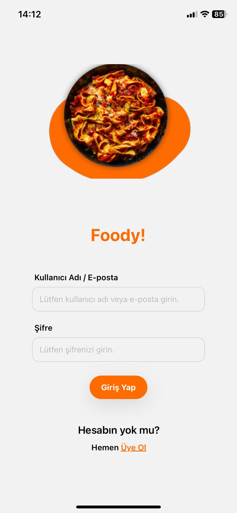
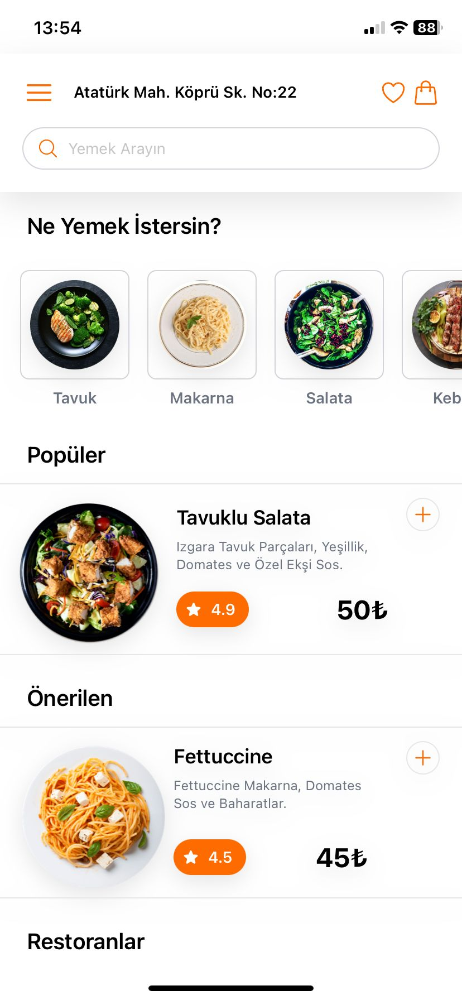
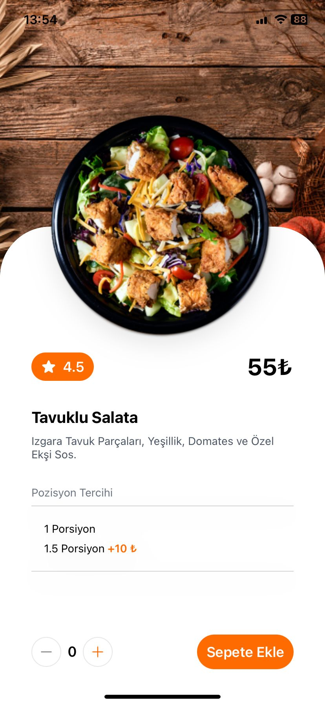
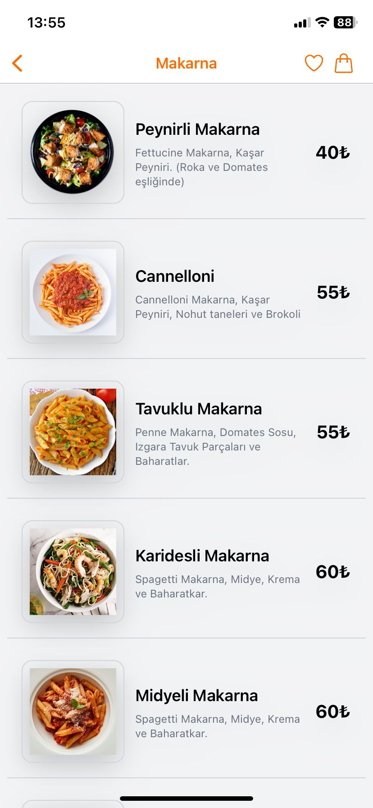
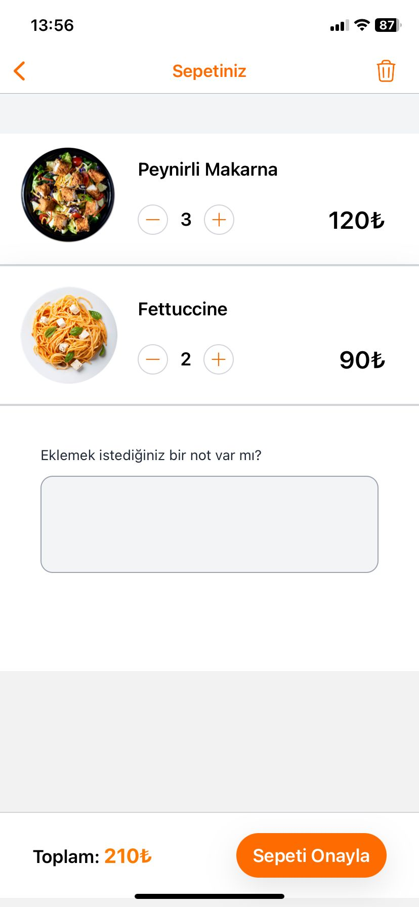
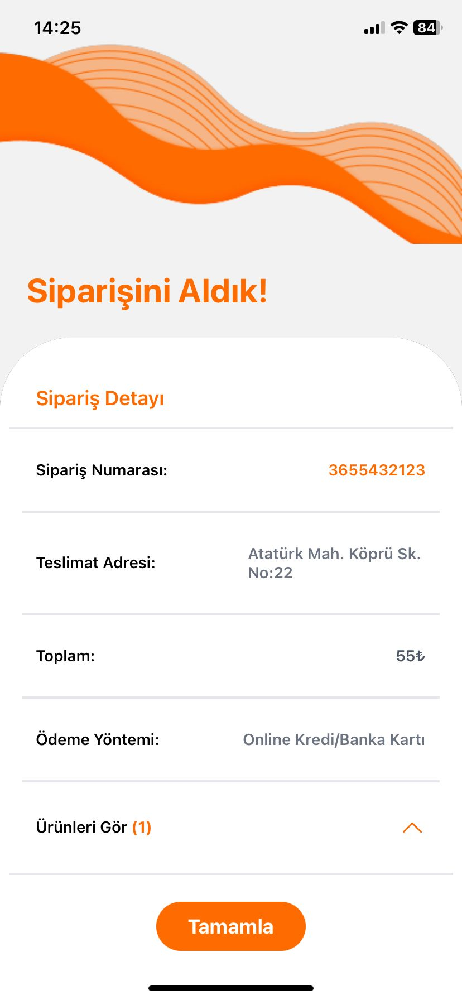
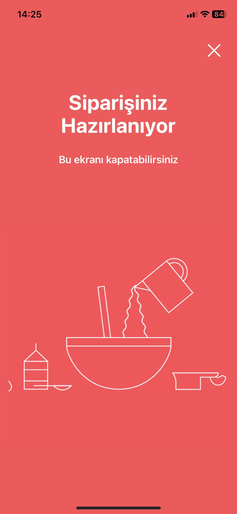

# Foody App

Food Ordering app with React Native, JavaScript and Tailwind CSS.
Thanks to Ecem Kaplan for the UI/UX design of the app. 
[UI/UX design of the app.](https://www.behance.net/gallery/161085439/Food-Ordering-App-UIUX-Design)

## Subject Of Project
Foody App is a mobile app project where you can order food. In this app, people can order different foods from different restaurants. People can view the meal details, choose the amount of food and add them to the cart. All foods added to cart are listed on the card detail screen. People can see the total price of the items in their cart and they can go to the payment section. If the payment section is completed, the order preparation animation will open. This means that the order transaction was successful.

## Technologies
<ul>
    <li>React Native</li>
    <li>JavaScript</li>
    <li>Tailwind CSS</li>
    <li>Redux</li>
    <li>React Native Navigation</li>
</ul>

## Usage Of Technologies
This app is written using JavaScript.
The app design was completed using Tailwind CSS. 
Navigation between screens is provided by React Native Navigation. 
Redux was used as global store to keep all cart items in the app. React native animatable library was used to preparing screen animation.

## How can I use this project?
Download or clone this repository. Then go to the project folder and follow these steps:

1. Install Expo Cli If you haven't already install.

   	npx install -g expo-cli

2. Install packages

    npm install

3. Start the project

    npx expo start

## Project UI

    
    

    
    

    
    

    

